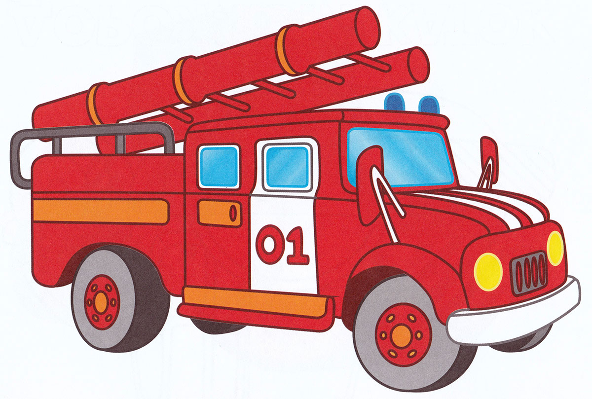

# 📔 Правила безопасной работы

Наиболее распространённая угроза при работе с лазером это возникновение пожара. Если например вы работаете с фанерой и выбрали неправильные параметры резания, то велик риск создать задымление и получить обгулявшуюся деталь, но скорее всего открытое пламя вы не создадите. Другое дело когда вы работаете с тонколистовыми и легковоспламеняющимися материалами, например бумагой или картоном, здесь вероятность поджечь станок возрастает в разы.

~~Наиболее вероятная угроза при использовании лазера это возникновении пожара. Если выбрать неправильный режимы резания например для фанеры, то большие шансы создать задымление и получить обугливающуюся деталь, но получить открытое пламя при работе все равно довольно проблематично. Но когда мы работаем с тонколистовыми или легковоспламеняющимися  материалами, например с бумагой или картоном, то вероятность пожара возрастает в разы.~~

#### Что делать есть пожар всё-таки произошел? <Написать что делать в случае пожара>

1. <mark style="background-color:orange;">Lift the top door. This often stops small flames.</mark>&#x20;
2. <mark style="background-color:orange;">Turn off the exhaust system.</mark>&#x20;
3. <mark style="background-color:orange;">Remove the material if it is safe to grab a corner.</mark>&#x20;
4. <mark style="background-color:orange;">If your job begins to produce large flames and/or excessive smoke, immediately notify the nearest GCLS staff member.</mark>

**Во время работы не оставляй лазер без присмотра!**

&#x20;

Другой опасный фактор при работе лазером, это использование неправильных материалов.

Например лазер без труда раскроит виниловую грампластинку, но она изготавливается из поливинилхлорида, при горении будет выделятся ядовитый хлор. Хлор опасен как для человека, так и для машины (студентов много, а количество машин ограниченно). Достаточно порезать лишь одну виниловую пластинку, и на следующий день все подвижные механизмы лазера будут скрипеть и начнут деградировать.

Все материалы, используемые на лазерном станке, должны быть одобрены персоналом Фабрики перед резкой.

**Изучите таблицу разрешенных материалов <ссылка на таблицу>**

.png>)

После завершения резки крышку корпуса лазера необходимо оставить закрытой не менее чем на 30 секунд, дождитесь чтобы система вентиляции успела отвезти дым и другие продукты горения.


Eсли в любой момент во время работы вы заметите что-либо необычное, немедленно выключите машину! Это включает в себя огонь, незакрепленные детали, деформированные материалы или все, что выглядит или звучит странно для вас **ЕСЛИ ВЫ СОМНЕВАЕТЕСЬ, ВЫКЛЮЧИТЕ МАШИНУ!**

